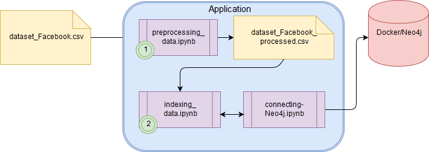

# Reproducibility in Research

This repository contains codes and files used during the subject course "Reproducibility in Research" at Unicamp. The main objective was to create an Executable Paper by providing all the necessary sources to reproduce the research.

## Files Structure

The files are organized as follow:

* /data - Dataset Facebook metrics (original and processed)
* /deliver - The executable paper and experiment's codes
* /dev - Codes and notebooks used during the experiment
* /figures - Figures used on research

## Development Environment
Before to start the experiment, make sure your setup is according to what is describe here. 

### Languages and Libraries
For running the experiments in this research the follows languages and libraries were selected:

1. Environment: [Anaconda3 4.3.1](https://repo.continuum.io/archive/index.html)
2. Programming Language: [Python 3.3](https://www.python.org/) 
3. Dataframe Library: [Panda 0.19.2](http://pandas.pydata.org/).
4. Neo4j-Python Driver: [Py2neo v3](http://py2neo.org/v3/)


### Graph Database

#### Option 1: Local
1. Install the [Neo4j 3.2.0 Community Edition](https://neo4j.com/download/other-releases/)
2. Run the Neo4j
3. In the Neo4j's Interface select an empty directory for your Graph Database (The Server has a default, check out) 
4. Start the Server
5. Open it in your Browser (http://127.0.0.1:7474/browser/)
6. In the first access, the ``user`` and ``password`` are ``neo4j``, but you have to change the ``password``(For the experiment used in this repository, the password used is ``neo4jresearch``, but you can create yours)
7. Go to [../deliver](../deliver) to run the codes.


#### Option 2: Docker
1. Install the [Docker toolbox](https://www.docker.com/products/docker-toolbox)
2. Create you account in [Docker Hub](https://hub.docker.com/)
3. In Docker Hub the Neo4j's image is available on: [Neo4j in Docker Hub](https://hub.docker.com/_/neo4j/)
4. Open your Docker Toolbox
5. Make the pull of the image: docker pull neo4j
6. Start an instance of Neo4j:
```
docker run \
    --publish=7474:7474 --publish=7687:7687 \
    --volume=$HOME/neo4j/data:/data \
    neo4j
```
7. Open in your Browser (http://localhost:7474) *Check out in the benning of your Docker shell the IP Address that it configures, and replace the localhost to the IP Address*
8. In the first access, the ``user`` and ``password`` are ``neo4j``, but you have to change the ``password``(For the experiment used in this repository, the password used is ``neo4jresearch``, but you can create yours)
Note: The Graph Database will be in the directory: ``$HOME/Neo4j/Data``

## Paper

The experiment results and paper of research is available in ``/deliver`` directory, or you can click here: [Paper](deliver/paper.ipynb)

## Workflow 

The workflow with the inputs and outputs of this research is organized as follows:



## Execute the experiment

To execute the experiment, follow the steps:

1. Make sure you have did all installation steps (development). 
2. Start your Neo4j Server.
3. Verifiy the code ``connection_neo4j.ipynb``. The ``host``, ``user`` and ``password`` need to be corrects. 
3. Follow the workflow image: first, execute the Prepreprocessing (``preprocessing_data.ipynb``).
4. Secondly, execute the ``indexing_data.ipynb``.
5. Open the Neo4j Server in Browser, the graph generated can be visualized.