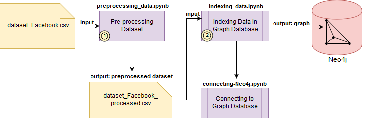

# Delivery 

In this directory you will find the [Paper](paper.ipynb) the corresponding ``.tex``, the ``references.bib`` and the codes used in the experiment.

## Workflow 

The workflow with the inputs and outputs of this research is organized as follows:

