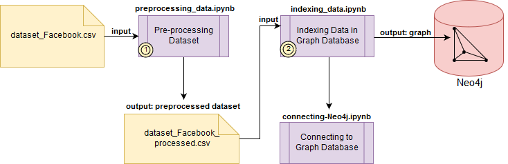

# Analysis of Social Network

## Objectives
The data from Social Network will be indexed in Graph Database, then data mining techniques will be implemented and some predictions will be extracted. Based on a paper, the first analysis will be the user engagement in posts of a branch page. The focus is understand the analysis model and reproduce on GDB.

## Workflow

## Description of data
The dataset used is available in http://archive.ics.uci.edu/ml/datasets/Facebook+metrics. The dataset has 19 features and 500 instances.

## Methods
Neo4j Graph Database will be used in this research. Neo4j has librarys to be used in Python.

## References
 S. Moro, P. Rita and B. Vala. Predicting social media performance metrics and evaluation of the impact on brand building: A data mining approach. Journal of Business Research, Elsevier, In press, 2016.

