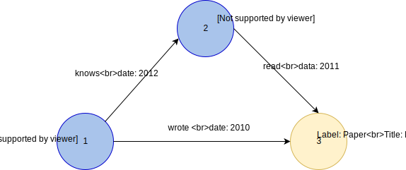
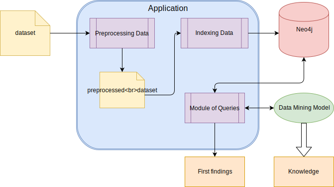
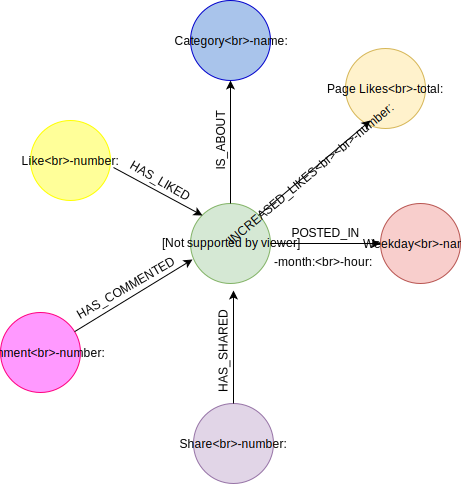
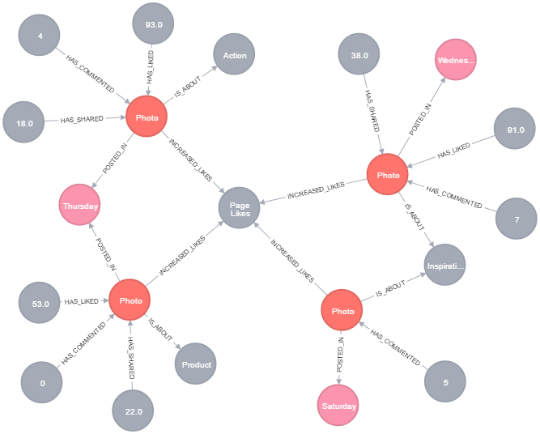

# An Analysis of Social Network Metrics based on Neo4j Graph Database

## Abstract
Nowadays, studies in social media, data mining and prediction are growing due to the volume of data generated from social networks. For storing this data, the tradicional relational databases are being replaced by alternative proposals. Within alternatives, the graph databases are an interesting option, considering the importance of relations in this format of data. So, this paper presents an approach to indexing data from social network metrics in a graph database, Neo4j, in order to analyze patterns and relations inside the data. For that, a dataset of Faceboook metrics is used, preprocessed and indexed in Neo4j.

## Introduction
The increase of users in social networks has escalated the investment and dissemination of social media \cite{social}. In this scenario, companies understood the pontential of using social networks to influence customers and incorporating social media marketing in their strategies of business. Therefore, studies about finding out relationships between online publications and users' interactions with them, data mining and prediction have emerged \cite{social}. 

In terms of the volume of these data generated every day and their characteristics, the traditional relational databases present limitations. For this kind of data, in which data connectivity and topological information are important, the NoSQL (Not Only SQL) has been demonstrated to be a good approach, mainly the Graph databases (GDBs) \cite{neo4j}. A graph is a collection of vertices and edges, representing entities as nodes and relationships among them. Through them, their structure allows us to model all kinds of contexts \cite{graphDB}.

Considering the context and the relevance of studies in social media, this research aims to combine resources that are offered by GDBs and data from social media. The main goal of this research is to index information about social media metrics in a GDB, in order to discover existing relations and patterns. 

The question that has based this research is if and how a GDB can facilitate data analyses of social media metrics. Considering the characteristics of GDB and the nature of the information in social network, our hypothesis is that storing data in graphs enables us to have more accessible and understandable queries, in comparison to other methods of storing data such as SQL, files, and other usual ones.

This paper is organized as follows. After this introduction, Section 2 presents the related works in social media and GDB. The methodology and workflow are presented in Section 3. Finally, in Section 4, the final remarks and future works are presented.

## Related Works

The proposal of this research is based on some researches in social media and graph database. Specially, research with Facebook metrics and GDB.

Moro et al. \cite{social} present an approach to predicting the performance metrics of a post published in brands' Facebook page by using data mining method. In order to validade their proposal, a dataset composed by 790 posts published by a company in the year of 2014 and 12 performance metrics extracted were used. The final dataset generated, called Facebook Metrics, was used in the experiment of this paper (as it is explained in the Section \ref{description}).

Souza et al. \cite{ewsdn} present an approach to provide a semantic modeling language support in a GDB with data about networking computing. They present a model of data and some primitives to answer questions about networking, for example, the shortest path between nodes and the counting in degree of a specific node. The GDB selected was Neo4j and Cypher query language (similar to SQL).

Robinson et al. \cite{graphDB} explain the GDB models and important characteristics: native graph and native graph processing. Besides this, for modeling data in Neo4j, the following elements are considered:
* Node - It is an entity;
* Label - It is a type of a node, it has a name and it groups the nodes in subsets;
* Relationship - It is a representation of an interaction between nodes.

Moreover, the Neo4j's model is the *Labeled Property Graph*. The Figure \ref{property} shows an example of this model, as follows:
* Nodes and relationships contain properties (key-value pairs);
* Nodes can be labeled with one or more labels;
* Relationships are named and directed (always there is a start and an end node).

These characterists allow us to represent the data in an intuitive way \cite{graphDB}. Furthermore, all necessary information can be modeled and stored. 

## Description of data

The dataset used in this research \cite{social} is available in http://archive.ics.uci.edu/ml/datasets/Facebook+metrics. The dataset is composed by 19 features and 500 instances. The features are from two groups: (i) list of input features used for modeling and (ii) list of output features to be modeled. For this research, the input features were selected, and the outputs related with the interaction numbers:

* Category - Manual content characterization: action (special offers and contests), product (direct advertisement, explicit brand content), and inspiration (non-explicit brand related content).
* Page total likes - Number of people who have liked the company's page.
* Type - Type of content (Link, Photo, Status, Video).
* Post month - Month the post was published (January, ..., December).
* Post hour -  Hour the post was published (0, 1, 2, ..., 23).
* Post weekday - Weekday the post was published (Sunday, ..., Saturday).
* Paid - If the company paid to Facebook for advertising (yes, no)
* Comments - Number of comments on the publication.
* Likes - Number of "Likes" on the publication.
* Shares - Number of times the publication was shared.

## Methodology 
In order to perform the experiment of this research, Neo4j 3.2.0 \cite{siteNeo4j} is the chosen one, due to the model of graph (explained in Section \ref{model}), documentation available and for its free access (community edition). The programming language selected was Python integrated with Jupyter, which promoves a productive environment to development codes. 

### Workflow
In summary the Figure \ref{workflow} shows the base workflow considered in this research. The proposal is to create an application that receives as an input the file with the *dataset* by the first code, *Preprocessing Data*, that selects the features of interest and adds/deletes necessary/unecessary information. The output of this process, *preprocessed dataset*, is the input of the *Indexing Data* code, that in its turn accesses the Neo4j and indexes the graph according to a model (presented in Section \ref{result}). Since the data is in Neo4j, the *Module of Queries* performs some queries to find patterns and relations. These discoveries are called *First findings*. The *Module of Queries* also can be used by a data mining model, selecting or adding information in Neo4j for future queries. The next subsection explain each step.

#### Preprocessing Data
As Section \ref{description} presented, the features selected for this experiment were the characteristics of the publication and the numbers of interaction. In this way, the steps executed in this preprocessing fase were:

1. Select the interested features - open the file and select the colunms;
2. Identify null values and exclude them - find the null values and exclude the corresponding rows;
3. Alter the category from number to value - the category feature, in the original dataset, is represented by a number (1,2,3), in this step, the corresponding category value is selected (Action, Product, Inspiration);
4. Alter the weekday from number to value - the weekday feature is represented by number, in this step, the corresponding weekday value is selected (Sunday, Monday, etc.);
5. Add Id attribute - add a sequencial number to represent the publication's identifier;
6. Sort the dataset - perform a descending chronological sort data;
7. Calculate and Add the increase in likes - calculate how many likes the page had in that day
8. Save the output - create the *preprocessed data*

#### Indexing Data
After the preprocessing step, the data is stored in the Neo4j. Before to index the data, it is necessary design the Data Model, the Figure \ref{datamodel} shows the model designed for the Facebook Metrics data.
In this model, the labels are: ``Post``, ``Weekday``, ``Category``, ``Like``, ``Comment``, ``Share``, ``PageLikes``. A ``Post`` has the *type* and *id* properties. The possible values to *type* are Link, Photo, Status or Video. A ``Weekday`` has a *name*, and in the Neo4j there are the 7 weekdays nodes. A ``Category`` has a *name* and its values are Action, Product or Inspiration. ``Like``, ``Comment`` and ``Share`` represent the users interactions, the property is *number*. Finally, ``PageLikes`` is a unique node, that represents the total page likes. 

These nodes are connected by some types of relationships. A ``Post`` has a relationship ``IS_ABOUT`` with a ``Category``, a relationship ``POSTED_IN`` with a ``Weekday`` and a relationship ``INCREASED_LIKES`` when there is an increase or a decrease in the number of page likes, this relationship has a *number* property. The relationship ``POSTED_IN`` has *month* and *hour* properties. ``Comment``, ``Like`` and ``Share`` has a relationship, respectively, ``HAS_COMMENTED``, ``HAS_LIKED`` and ``HAS_SHARED``  with ``Post``.

The Figure \ref{graph} presents a visualization of a example of graph indexed in Neo4j.

#### Module of Queries and Data Mining
With the data indexed in Neo4j, the next step is to write queries in order to answer questions about patterns and relations inside the data. This discovery is called *First findings*. There are some alternatives to write queries for Neo4j, but the recommended is the Cypher Language. This is the native query language of Neo4j, like SQL, and it is a pattern-matching language. Moreover, Cypher is designed to be easily read and understood by developers \cite{graphDB}. Another desirable feature, for this module, is to give inputs to data mining models in order to improve the results. Although this step was not performed, it is suggested as future research in Section \ref{future}. 

## Results and Future Works
This research presented a way to prepare and to index data from social network metrics in a GDB, in order to analyze the data and their relations. The main contribution of this research is the data model designed for the Facebook metrics dataset, since it offers a visual understanding of how significant the publications were in the social media environment. The research is not finished and it is necessary to work on *Module of Queries*, but the steps of preprocessing and indexing data were performed successfully. 
As for future works, the following issues can be listed:
* First, to create the queries about data relations and patterns, in order to create the *First findings*;
* Secondly, to design how data mining can be combined with GDB, based on the results of this research.

## References
 S. Moro, P. Rita and B. Vala. Predicting social media performance metrics and evaluation of the impact on brand building: A data mining approach. Journal of Business Research, Elsevier, In press, 2016.
