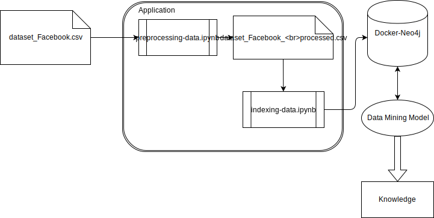

# Development Environment
This directory is composed by all codes used during the experiments. 

## Languages and Libraries
For running the experiments in this research, the Programming Language selected was [Python](https://www.python.org/) and the Graph Database used was [Neo4j](https://neo4j.com/). Moreover, the environment to develop is [Jupyter](http://jupyter.org/), and lastely, the libraries used was [Py2neo](http://py2neo.org/v3/) and [Panda](http://pandas.pydata.org/).

## Workflow

